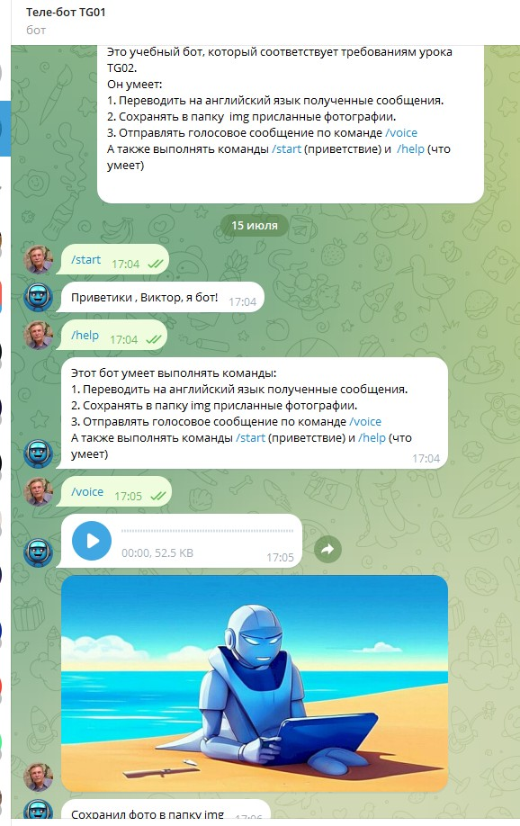

# Обработка входящих сообщений от пользователей и отправка текста и мультимедийных файлов

## ЗАДАНИЕ

Напишите код для сохранения всех фото, которые отправляет 
пользователь боту в папке img.

Отправьте с помощью бота голосовое сообщение.

Напишите код для перевода любого текста, который пишет пользователь 
боту, на английский язык.

## Результат

